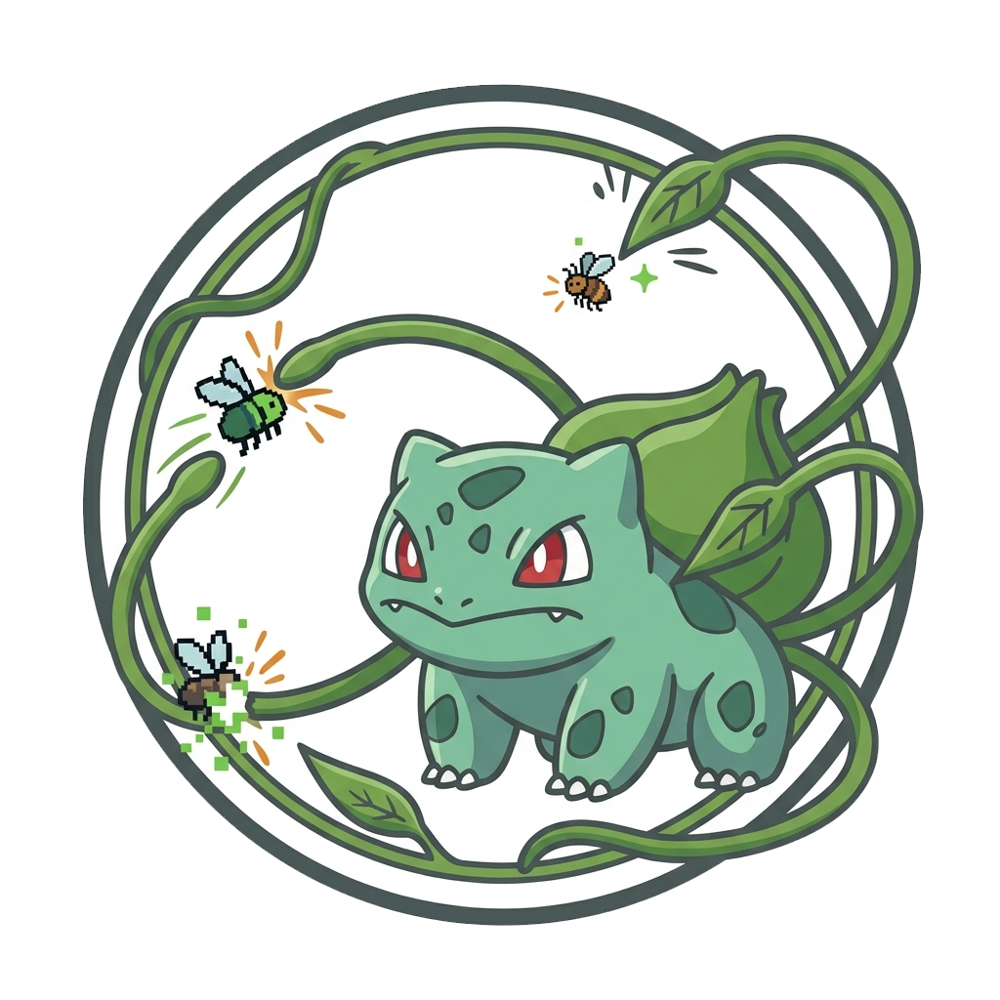

# Bulbasaur



Bulbasaur is a Coverage-Guided Greybox Fuzzer (CGF) that implements the core techniques described in the **BULBASAUR** paper.

Unlike conventional fuzzers that rely solely on generic mutation operators, Bulbasaur integrates an agent into the fuzzing loop to generate branch-specific mutation functions on demand. When the fuzzer stalls on a hard branch constraint, the bridge gives the selected agent (Claude Code, Codex, or the built-in mini harness) the relevant source context; the agent produces a targeted Rust mutation function that is compiled to a shared library and loaded at runtime. This allows the fuzzer to perform precise, reusable mutations tailored to individual branch conditions rather than relying on random byte flips.

Bulbasaur is built on top of [AFL++](https://github.com/AFLplusplus/AFLplusplus) instrumentation and adopts a three-target execution model (fast / full / trace) paired with Thompson Sampling–based seed scheduling and TaintFuzz-style operand-guided mutation.

<br clear="right"/>

## Key Innovation

The central challenge in coverage-guided greybox fuzzing is generating inputs that satisfy branch constraints in order to reach deep code regions. Existing techniques rely on general-purpose mutators that lack the ability to precisely manipulate the relevant input bytes.

**Bulbasaur's key innovation**: use an agent to generate customised mutation functions for specific branch constraints. These functions perform localised, reusable modifications on inputs that already reach the target branch, producing mutations that precisely satisfy the constraint.

> *Coverage-Guided Greybox Fuzzing (CGF) hinges on generating inputs that satisfy branch constraints in order to explore deep code regions. Existing CGF techniques propose various approaches to improve the probability of solving such constraints. However, they still rely on general-purpose mutators, which lack the ability to precisely manipulate relevant input bytes to satisfy complex constraints. Our analysis reveals that coding agents can more accurately solve branch constraints by generating tailored mutators. These mutators enable the fuzzer to perform localized and reusable modifications on inputs that reach target branches, producing precise mutations to satisfy target constraints. To achieve this, we propose BULBASAUR, a branch-guided framework for online agent-based mutator generation. BULBASAUR employs hard frontier-guided branch selection to identify critical branches, continuously collects and organizes relevant static and dynamic context to support high-quality mutator generation, and adopts an efficient and adaptive strategy to apply generated mutators during fuzzing.*

## Documentation

| Document | Contents |
|----------|----------|
| [docs/architecture.md](docs/architecture.md) | System architecture: chunked bitmap, Agent mutation thread, seed scheduling, TaintFuzz, instrumentation pipeline |
| [docs/build.md](docs/build.md) | Building Bulbasaur and compiling target programs |
| [docs/usage.md](docs/usage.md) | Running Bulbasaur: basic mode and Agent mode, with parameter reference |
| [docs/tools.md](docs/tools.md) | Utility tools: `branch_analyser`, `test_mutation_function` |
| [fuzzer/README.md](fuzzer/README.md) | Fuzzer internals: core components, mutation strategies, seed scheduling, multi-threading |
| [afl_llvm_mode/instrumentation/README.bulbasaur-instrumentation.md](afl_llvm_mode/instrumentation/README.bulbasaur-instrumentation.md) | LLVM instrumentation passes: fast/full/trace/debug pass details, ELF section layout |
| [llm_scripts/README.md](llm_scripts/README.md) | Agent bridge script detailed reference |

## Agent backend update

Bulbasaur now uses one agent bridge with three interchangeable backends: Claude Code (`claude`), Codex (`codex`), and the lightweight in-project mini harness (`mini`). The original project LLM agent implementation has been removed. `mini` is the default so a fresh checkout can run without an external coding-agent installation; for the best mutator quality, use Claude Code or Codex when available. All three backends receive the same Bulbasaur skill and source-inspection workflow, and the fuzzer-facing protocol is unchanged.

### Agent setup and permissions

Install and authenticate an external CLI before selecting it:

```bash
npm install -g @anthropic-ai/claude-code
npm install -g @openai/codex
claude --version
codex --version
```

Use `BULBASAUR_AGENT=claude` or `BULBASAUR_AGENT=codex` together with the
`BULBASAUR_AGENT_*` environment variables when using a compatible gateway.
The bridge runs both external CLIs non-interactively and bypasses their
permission/sandbox prompts; run Bulbasaur from a trusted workspace or outer
container. Claude and Codex use their native full tool sets, while the shared
Bulbasaur skill keeps the mutator and seed-enrichment prompts consistent.

## Quick Start

### 1. Build

```bash
export PATH=/path/to/clang+llvm-13/bin:$PATH
cd afl_llvm_mode && make -j$(nproc) && cd ..
cargo build --release
```

### 2. Compile the target (autoconf project example)

```bash
export CC=/path/to/Bulbasaur/afl_llvm_mode/afl-cc
export CXX=/path/to/Bulbasaur/afl_llvm_mode/afl-c++
./configure --disable-shared

# Basic mode requires 3 variants
make clean && BULBASAUR_INST_MODE=FAST  make -j$(nproc) && cp <binary> targets/<program>_fast
make clean && BULBASAUR_INST_MODE=FULL  make -j$(nproc) && cp <binary> targets/<program>_full
make clean && BULBASAUR_INST_MODE=TRACE make -j$(nproc) && cp <binary> targets/<program>_trace

# Agent mode additionally requires a debug variant (embeds source location information)
make clean && BULBASAUR_INST_MODE=DEBUG BULBASAUR_BRANCH_LOC_PATH=/path/to/output/ make -j$(nproc) \
    && cp <binary> targets/<program>_debug
```

### 3. Run

**Basic mode**

```bash
target/release/fuzzer \
    -i seeds/ -o output/ -j 4 \
    -f targets/<program>_full \
    -t targets/<program>_trace \
    -- targets/<program>_fast @@
```

**Agent mode**

```bash
export BULBASAUR_AGENT="mini"         # mini is default; Claude Code and Codex are recommended for best results
export BULBASAUR_AGENT_API_KEY="your-api-key"
export BULBASAUR_AGENT_BASE_URL="https://your-agent-gateway.example"
export BULBASAUR_AGENT_MODEL="gpt-5.6-luna"

python3 llm_scripts/bulbasaur_llm_bridge.py \
    --fuzzer      target/release/fuzzer \
    --fast-target  targets/<program>_fast \
    --full-target  targets/<program>_full \
    --trace-target targets/<program>_trace \
    --debug-target targets/<program>_debug \
    --corpus       seeds/ \
    --output-dir   output/ \
    --branch-mapping targets/branch_loc.csv \
    --source-base-path /path/to/target/src \
    --agent mini --agent-model gpt-5.6-luna \
    --jobs 4 --cpu-id 0 \
    --exec-args @@
```

See [docs/build.md](docs/build.md) and [docs/usage.md](docs/usage.md) for full details.

Add `--seed-enrich` to run the selected agent before fuzzing. With `--agent mini`,
the built-in harness is used; with `--agent codex` or `--agent claude`, the
corresponding CLI is used. The agent may inspect the target source and write
generator scripts plus complex candidates in the retained workspace
`<output-dir>/seed_enrichment/`; candidate files are copied to a new enriched
corpus after deduplication and safety checks, while the original corpus remains
unchanged. The default enriched corpus is `<corpus>.enriched` and becomes the
fuzzer's input; pass `--seed-enrich-dir` to choose another location.
Conversation trajectories are stored under `<output-dir>/conversation_logs/`,
and the fuzzer continues to write its logs and queue/crash artifacts under
`<output-dir>`. The agent chooses the number of seeds from target complexity;
there is no fixed seed-count quota. No target executable is used by the Agent
during this seed stage, although the complete bridge invocation still supplies
the four fuzzer target variants needed by the runtime.

## Project Structure

```
Bulbasaur/
├── afl_llvm_mode/           # LLVM instrumentation passes and compiler wrapper scripts
│   └── instrumentation/     # Source for the four passes (fast/full/trace/debug)
├── fuzzer/                  # Main fuzzer (Rust)
│   └── src/
│       ├── bin/             # Entry points: main.rs, branch_analyser.rs, test_mutation_function.rs
│       ├── branches/        # GlobalBranches (chunked bitmap + frontier_branch_map)
│       ├── depot/           # Seed corpus management, Thompson Sampling scheduling
│       ├── executor/        # Forkserver, three-target execution, ForkMutationExecutor
│       ├── search/          # Mutation strategies (AFL havoc, TaintFuzz, trim)
│       ├── llm_loop.rs      # Agent mutation function loader thread
│       ├── fuzz_loop.rs     # Main fuzzing loop (per thread)
│       └── stats/           # Statistics and terminal UI
├── common/                  # Shared Rust library (config, shared memory definitions, trace data structures)
├── llm_scripts/             # Agent bridge (Python; fuzzer-facing adapter only)
│   ├── bulbasaur_llm_bridge.py   # Launches fuzzer + socket server
│   ├── agent_cli.py               # Claude Code/Codex/mini process adapter and prompt
│   ├── mini_harness.py            # Vendored mini-swe-agent isolation adapter
│   ├── seed_enricher.py           # Initial agent-assisted corpus enrichment
│   ├── skills/bulbasaur-mutator/SKILL.md
│   ├── file_utils.py             # Branch mapping, ELF parsing, source file lookup
│   ├── compilation.py            # Generated Rust → cargo build → .so
│   └── README.md
├── third_party/mini-swe-agent/ # Vendored lightweight agent harness (MIT)
├── docs/                    # Detailed documentation
├── Cargo.toml
└── README.md
```

## Acknowledgements

Bulbasaur's framework is based on [Angora](https://github.com/AngoraFuzzer/Angora) (S&P 2018) and incorporates techniques from [AFL++](https://github.com/AFLplusplus/AFLplusplus).

If you have any questions, please contact wangyiyi25@mails.tsinghua.edu.cn; feel free to reach out.

> Important: This codebase has just been reorganized and has only received small-scale local testing. If you encounter any problems, please open an issue or tell me; I will fix them.
